# ACC Agentic Migration Platform
## Redesign of the Databricks / Snowflake → AWS-Native Accelerator as an Agentic AI Platform

**Owner:** Data Practice Lead · **Version:** 0.3 · **Date:** 16 Sep 2026 · **Classification:** Internal
**Companion document:** AWS Migration Accelerator — Build Plan v0.5 (Databricks-first scope decision, 16 Sep 2026)

---

## 1. Why redesign

The v0.4 plan builds seven excellent deterministic tools operated by consultants. That wins deals in 2026 but has three structural limits:

1. **Linear scaling.** Every engagement still needs senior engineers to interpret assessment output, triage conversion failures, decide wave order and chase reconciliation breaks. The accelerator shortens tasks; it does not remove the judgement bottleneck.
2. **Learning is manual.** A construct that broke conversion at client A is only fixed for client B if someone remembers to write the rule.
3. **Point-to-point.** Snowflake→Redshift and Delta→Iceberg are hard-coded pairs. The next demand signal (BigQuery exits, Synapse/Fabric moves, Iceberg→Iceberg cross-cloud) means new tools, not new configuration.

The redesign keeps every deterministic asset — they become the **tools** — and adds an agentic layer that plans, executes, verifies and learns, with humans holding the risk gates. The design principle throughout: **agents reason and propose; deterministic tools execute; humans approve at risk boundaries; everything is evidenced.**

---

## 2. Design principles

| Principle | What it means in practice |
|---|---|
| Deterministic core, agentic shell | No LLM ever writes to a target system directly. Agents call typed tools; tools are the only path to side effects. |
| Evidence over eloquence | Every agent decision is logged with inputs, reasoning summary, tool calls and outcome. Reconciliation, not the model's confidence, decides success. |
| Human at the risk boundary | Autonomy is graded (section 5). Assessment is fully autonomous; cut-over never is. |
| Client boundary is sacred | Models run inside the client's AWS account/region via Amazon Bedrock. No data, metadata or code leaves the account. No training on client data. |
| Open protocols | MCP for all tool exposure; model-agnostic via Bedrock; OpenTelemetry for traces; Iceberg as the interchange format. Nothing ACC builds is coupled to a single model vendor. |
| Learn from every engagement | Manual interventions become rules, tests and retrieval entries automatically, subject to review. The platform gets cheaper per engagement. |
| Source- and target-agnostic by construction | Source and target are adapters implementing a common capability contract. Databricks, Snowflake, Redshift, Iceberg are the first four; BigQuery and Fabric are configuration, not rewrites. |

---

## 3. Target architecture

```mermaid
flowchart TB
    subgraph HUMAN["Human layer"]
        PORTAL["Migration Console<br/>(web app · approvals · evidence · chat)"]
        LEAD["Engagement architect / client approver"]
    end

    subgraph AGENTS["Agent layer — Amazon Bedrock AgentCore"]
        ORCH["Migration Orchestrator Agent<br/>plans waves · assigns work · tracks state"]
        ASSESS["Assessment Agent"]
        CONV["Code Conversion Agent"]
        TABLE["Table Migration Agent"]
        GOV["Governance Agent"]
        RECON["Reconciliation Agent"]
        CUT["Cut-over Agent<br/>(propose-only)"]
        COMP["Compliance & Policy Agent<br/>(cross-cutting veto)"]
    end

    subgraph TOOLS["Tool layer — MCP servers (deterministic accelerators)"]
        T1["assess-mcp<br/>metadata extract · TCO · wave graph"]
        T2["convert-mcp<br/>SQLGlot transpile · AST rewrite · test runner"]
        T3["table-mcp<br/>Delta→Iceberg · Glue register"]
        T4["gov-mcp<br/>policy extract · LF Terraform gen · OPA test"]
        T5["recon-mcp<br/>checksums · diffs · sign-off report"]
        T6["orch-mcp<br/>DAG gen · Step Functions ASL"]
        T8["jobs-mcp<br/>notebooks/DLT → Glue/EMR templates"]
        T7["aws-mcp<br/>Terraform apply · EMR/Glue/Redshift ops (scoped IAM)"]
    end

    subgraph KNOW["Knowledge & memory"]
        KB["Knowledge base<br/>dialect rules · ADRs · runbooks · AWS docs"]
        MEM["Engagement memory<br/>decisions · exceptions · approvals"]
        LEARN["Learning loop<br/>intervention → rule/test candidate → review → merge"]
    end

    subgraph PLAT["Platform services"]
        EVAL["Evaluation harness<br/>golden sets · replay · regression"]
        GUARD["Guardrails<br/>Bedrock Guardrails · prompt-injection filters · PII redaction"]
        OBS["Observability<br/>OTel traces · execution ledger · cost meter"]
        ID["Identity<br/>AgentCore Identity · IAM · client SSO"]
    end

    subgraph SRC["Sources (read-only)"]
        DBX["Databricks / Unity Catalog"]
        SNOW["Snowflake"]
    end
    subgraph TGT["Target (client AWS account)"]
        AWS["S3 + Iceberg · Glue DC · Lake Formation<br/>Redshift · EMR Serverless · Athena · MWAA"]
    end

    LEAD --> PORTAL --> ORCH
    ORCH --> ASSESS & CONV & TABLE & GOV & RECON & CUT
    COMP -.veto/annotate.-> ORCH & CONV & TABLE & GOV & CUT
    ASSESS --> T1
    CONV --> T2 & T8
    TABLE --> T3
    GOV --> T4
    RECON --> T5
    ORCH --> T6
    TABLE & GOV & CUT --> T7
    T1 & T2 & T3 & T5 -->|read only| DBX & SNOW
    T3 & T4 & T5 & T6 & T7 --> AWS
    AGENTS <--> KB & MEM
    RECON & CONV --> LEARN --> KB
    AGENTS --> GUARD & OBS & ID & EVAL
```

Everything inside the dotted client boundary — agents, tools, models (via Bedrock), knowledge base copies, memory, ledger — is deployed **into the client's AWS account** by Terraform. ACC hosts nothing at engagement time. The only ACC-side components are the master knowledge base, the evaluation corpus and the release pipeline.

---

## 4. Agent roster

Each agent has a narrow charter, a fixed tool allow-list, a defined autonomy level and an owner. Agents do not call other agents' tools; they hand off through the Orchestrator.

| Agent | Charter | Tools (MCP) | Autonomy | Key outputs |
|---|---|---|---|---|
| **Migration Orchestrator** | Own end-to-end state; sequence waves; dispatch work; escalate; produce status | orch-mcp, memory, all agents via handoff | L2 — plans autonomously, executes only approved plans | Wave plan, daily status, exception queue |
| **Assessment** | Discover, profile, classify workloads; produce TCO and wave candidates; explain findings in business terms | assess-mcp, KB | L3 — fully autonomous (read-only) | TCO report, wave graph, consumption-layer recommendation with rationale |
| **Code Conversion** | Transpile SQL/notebooks/DLT; when deterministic transpile fails, propose a conversion, generate tests, run them, iterate; flag semantic risk | convert-mcp, KB, EMR/Redshift test sandbox | L2 — autonomous on deterministic path; LLM-proposed conversions require test pass + reviewer accept | Converted code with per-object confidence, test evidence, manual-review queue |
| **Table Migration** | Choose Delta→Iceberg strategy per table; execute conversion; register in Glue; validate reads across engines | table-mcp, aws-mcp (scoped) | L2 — executes into staging autonomously; promotion to prod path requires approval | Converted tables, per-table strategy record, read-validation matrix |
| **Governance** | Translate UC/Snowflake policies to Lake Formation; detect semantic gaps; generate and test Terraform; produce audit narrative | gov-mcp, aws-mcp (plan only) | L1 — proposes; every grant applied requires human approval | LF Terraform, gap register, control mapping evidence |
| **Reconciliation** | Design validation appropriate to each table (tolerances, sampling); run; diagnose breaks; propose root cause and fix | recon-mcp, KB | L3 — autonomous; findings are evidence not action | Sign-off report, break analysis, fix proposals routed to Conversion/Table agents |
| **Cut-over** | Assemble cut-over plan, checklists, rollback; simulate; monitor during execution | orch-mcp, aws-mcp (read + pre-approved runbook steps) | L0/L1 — propose-only; humans execute or approve each step | Cut-over runbook, go/no-go evidence pack, live monitoring |
| **Compliance & Policy** | Cross-cutting veto: residency, data-class handling, offshore-eligibility of tasks, regulatory disclosures; annotates every plan with control mapping | OPA policy engine, KB (regulatory), memory | Always-on; veto is deterministic (policy-as-code), explanation is LLM | Policy decisions, compliance pack sections auto-populated, DORA/PRA/RBI evidence |

**Model assignment (via Bedrock, in-region):** a frontier model (Claude class) for Orchestrator, Conversion and Governance where reasoning quality dominates; a smaller, faster model for Assessment classification and Reconciliation break triage where volume dominates. Model IDs are configuration; the evaluation harness (section 7) is what licenses a model swap.

---

## 5. Graded autonomy and human oversight

| Level | Meaning | Applies to |
|---|---|---|
| **L0** | Agent observes and explains only | Cut-over execution |
| **L1** | Agent proposes; human approves each action | Governance grants, production promotion, cut-over steps |
| **L2** | Agent executes within an approved plan; humans approve the plan and review exceptions | Orchestration, conversion, table migration into staging |
| **L3** | Fully autonomous within a read-only or evidence-only scope | Assessment, reconciliation |

Rules that never relax:
- Any write to a production-path target requires a human approval recorded in the ledger.
- Any action touching data classified Restricted/PCI/personal requires the Compliance Agent's pass **and** human approval.
- Offshore-eligibility of each task is evaluated by policy; onshore-only tasks are routed to the onshore approver queue (aligns with the hybrid delivery model in the build plan).
- Humans can pause any agent, roll back any wave, and override any recommendation; overrides are captured as learning signals.

---

## 6. Knowledge, memory and the learning loop

**Knowledge base (ACC master + per-client copy):** dialect conversion rules with examples and counter-examples; Iceberg/Delta behaviour notes per version; AWS service limits and pricing snapshots; ADRs and runbooks; regulatory control mappings; anonymised engagement patterns. Stored in Bedrock Knowledge Bases (OpenSearch Serverless vectors) with structured metadata filters so retrieval is scoped to source/target/version.

**Engagement memory (per client, in client account):** decisions taken, exceptions granted, approvals, tolerances agreed, naming conventions, open questions. Held in AgentCore Memory with a DynamoDB ledger for the immutable record. Deleted or handed to the client at engagement end per contract.

**Learning loop:**
1. Every manual intervention (a reviewer edits a conversion, overrides a wave, adjusts a tolerance) is captured with before/after and reason.
2. A background Curator agent proposes a generalised rule, a golden test case and a KB entry — anonymised, with client identifiers stripped by policy.
3. Proposal lands in an ACC review queue; a senior engineer accepts, edits or rejects.
4. Accepted items merge into the tool code (SQLGlot rules, AST rewrites), the evaluation corpus and the master KB via the normal CI pipeline.

Nothing learned from a client flows to another client without passing anonymisation policy and human review. This is both a compliance control and the mechanism by which the platform's unit cost falls with every engagement.

---

## 7. Evaluation, guardrails and safety

**Evaluation harness (the license to change anything):**
- Golden corpus: the benchmark set from the build plan, grown by the learning loop. Every agent and model change replays the corpus.
- Metrics per agent: conversion clean rate, semantic-equivalence pass rate (executed results match), reconciliation false-positive/negative rates, TCO accuracy vs. actuals, plan-quality rubric scored by a judge model and spot-checked by humans, tokens and cost per object.
- Release gate: no regression beyond agreed thresholds; new model versions must match or beat incumbents before promotion.
- Continuous shadow mode: new agent versions run alongside production in shadow on live engagements, outputs compared, never actioned.

**Guardrails:**
- Bedrock Guardrails for PII detection/redaction in prompts and outputs, denied topics, grounding checks against retrieved sources.
- Prompt-injection defence: all content read from source systems (SQL comments, notebook markdown, table descriptions, policy names) is treated as untrusted data, wrapped and labelled, never as instructions; tool schemas are strict; agents cannot request tools outside their allow-list.
- Output validation: every generated artefact (SQL, Terraform, DAG, ASL) is parsed, linted and tested by deterministic tools before it is shown to a human, let alone applied.
- Cost and blast-radius limits per agent per run (token budgets, max objects per wave, max concurrent EMR jobs).

**AI governance (maps to compliance section of the build plan):**
- Model cards and intended-use statements per agent; EU AI Act classification (limited-risk; transparency obligations met by disclosure in the console and reports).
- Model-risk management pack for FSI clients: validation evidence from the harness, monitoring plan, human-oversight description, change log. Fits SR 11-7 / PRA SS1/23-style expectations.
- No fine-tuning on client data; Bedrock's no-training guarantee documented; all inference in-region.

---

## 8. Technology stack (revised for the agentic platform)

| Layer | Choice | Rationale |
|---|---|---|
| Agent runtime | **Amazon Bedrock AgentCore** (Runtime, Gateway, Memory, Identity, Observability) | Managed, in client account, MCP-native, IAM-integrated; avoids ACC operating agent infrastructure |
| Agent framework | **Strands Agents SDK** (primary); LangGraph acceptable where explicit state machines are needed | Python, MCP-first, AgentCore-native; minimal lock-in |
| Models | Claude (frontier) and a smaller model via **Bedrock**; configurable per agent | In-region inference, no training on data, model swap without code change |
| Tool protocol | **MCP** servers per accelerator, exposed through AgentCore Gateway | One integration surface for agents, IDEs (Claude Code, Q Developer) and the console |
| Policy | **OPA / Rego** via the Compliance Agent | Deterministic veto; auditable; version-controlled |
| Knowledge | Bedrock Knowledge Bases on OpenSearch Serverless; S3 for documents | Managed RAG with metadata filtering |
| Ledger and memory | DynamoDB (immutable execution ledger) + AgentCore Memory | Evidence-grade record; per-client isolation |
| Console | React + TypeScript; Cognito or client SSO; hosted in client account (Amplify/CloudFront) | Approval queues, evidence browser, chat with agents, cost meter |
| Deterministic tooling | Unchanged from build plan: Python 3.12, SQLGlot, PySpark on EMR Serverless, PyIceberg, delta-rs, LibCST, Great Expectations/Deequ, Terraform | These are the tools; the redesign does not replace them |
| Evaluation | pytest + custom harness; judge-model scoring; promptfoo-style config for prompt regression | Release gate for agents and models |
| Observability | OpenTelemetry → CloudWatch + AgentCore Observability; cost attribution per agent/run | Traces link reasoning to tool calls to outcomes |
| Engineering platform | As per build plan section 6 (CI security gates, SBOM, signed releases, IaC) | Unchanged |

---

## 9. Extensibility: adapters not forks

Sources and targets implement a common **capability contract**: `discover`, `profile`, `extract_policy`, `read_table`, `read_code`, `execute_test`, and (targets only) `register_table`, `apply_policy`, `deploy_job`. Agents reason against the contract; adapters implement it.

| Roadmap | Adapter | Effort class |
|---|---|---|
| v1 | **Databricks/UC only** → Iceberg on S3, Redshift, Athena, EMR/Glue, MWAA | Build |
| v1.2 (Phase B) | Snowflake as source (extractors, SQL/procedure conversion via SCT + SQLGlot, RBAC → LF, Tasks → Step Functions) | New adapter, same agents |
| v1.1 | S3 Tables as an Iceberg target; SageMaker Lakehouse catalog | Configuration + small adapter |
| v2 | BigQuery, Synapse/Fabric as sources; MLflow → SageMaker; Structured Streaming → Flink/MSK | New adapters, same agents |
| v2+ | Reverse and cross-cloud (Iceberg→Iceberg with catalog federation); Snowflake/Databricks **as targets** for clients moving the other way | Adapter symmetry; TCO agent already models it |

This is what "future-ready" means in practice: the next migration pattern is an adapter and a KB update, not a new accelerator programme.

---

## 10. Revised build sequencing

The build plan's Phases 0–2 stay almost intact — the deterministic tools must exist before agents can call them. Two changes:

1. **Wrap every tool as an MCP server from day one** (Phase 1 onwards). Cost is small; it makes the tools usable from Claude Code/Q Developer immediately and from agents later.
2. **Add a parallel Agent track from week 6**, ending in an extended Phase 3.

| Weeks | Deterministic track (unchanged) | Agent track (new) |
|---|---|---|
| 1–2 | Mobilise | Agent platform sandbox (AgentCore, Bedrock model access, Guardrails), evaluation harness skeleton |
| 3–8 | WS-A/B/C | MCP wrappers; Assessment Agent (L3, lowest risk, highest demo value); Compliance Agent policy core |
| 9–13 | WS-D/E/F/G | Reconciliation Agent; Conversion Agent on deterministic path; Orchestrator with human-approved plans; console MVP |
| 14–18 | Harden, GTM | Governance and Table agents at L1/L2; learning loop v1; model-risk pack; shadow-mode run on the internal dataset end-to-end |
| 19–22 | — | Pilot 1 (India) and Pilot 2 (UK/EU) with agents in shadow → assisted mode; Gate 4 |

**Additional team:** 1 agentic-AI engineer (Strands/AgentCore/Bedrock), 1 ML/evaluation engineer (part-time from week 6), product owner time increases to 0.8 for the console. Indicative uplift: **+35–40 person-weeks**, bringing the programme to ~120 person-weeks over 22 weeks. Gates 0–3 unchanged; **Gate 4 (week 22):** agents pass the evaluation thresholds, model-risk pack approved, both pilots run with agent assistance and human approvals recorded.

---

## 11. Product posture: productised accelerator, option on a governance product

Decision (16 Sep 2026): the platform is delivered as an **accelerator inside ACC engagements**, built to product standards, not licensed to clients in v1. The **governance and evidence layer** — execution ledger, Compliance & Policy Agent with OPA veto, graded-autonomy approval flow, compliance-pack generation, Migration Console approval surface — is architected as a separable module (`acc-govern`) with its own MCP interface and Terraform module, so it can be spun out as a product without refactoring the converters. Review at Gate 4 against the three triggers recorded in the build plan §0. Until then: no licence terms, no support SLAs, no product marketing spend.

Design consequences now:
- No converter may depend on internals of the governance layer; interaction is via the ledger API and policy decisions only.
- Governance layer has its own versioning line and evaluation suite.
- Client-facing naming keeps "ACC Migrate" for the accelerator; the governance layer is unnamed externally until Gate 4.

## 12. What changes commercially

- **Pricing model shifts** from pure T&M toward platform + outcomes: assessment as a fixed-price, largely autonomous product; migration priced per wave with a platform fee; hypercare with agent monitoring.
- **Margin improves per engagement** as the learning loop reduces manual conversion effort; track "manual interventions per 100 objects" as the north-star operational metric.
- **Client sovereignty is the pitch.** Everything runs in their account, on their Bedrock quota, with their SSO, and they keep the platform and evidence at exit. This resolves most DORA/PRA/RBI third-party objections structurally.
- **AWS alignment strengthens**: the platform is a showcase for AgentCore, Bedrock, S3 Tables and Lake Formation; strong candidate for co-sell, Marketplace listing and partner programme evidence.

---

## 13. Key risks specific to the agentic design

| Risk | Mitigation |
|---|---|
| LLM-proposed conversions are subtly wrong | Never accepted without executed semantic-equivalence tests; confidence surfaced to reviewer; regression corpus grows |
| Prompt injection via source metadata/code | Untrusted-data wrapping, strict tool schemas, allow-lists, output validation by deterministic parsers, Guardrails |
| Client risk teams reject "AI in the migration" | Graded autonomy, model-risk pack, propose-only for anything irreversible, full ledger; offer L1-everywhere mode |
| Agent platform lock-in to AWS | MCP tools and Strands run anywhere; AgentCore is the managed convenience, not the dependency; documented portability |
| Cost overrun on inference | Per-run token budgets, smaller models for high-volume tasks, cost meter in console, deterministic path preferred |
| Learning loop leaks client specifics | Anonymisation policy enforced by Compliance Agent before curation; human review before merge; audit of KB provenance |
| Model version drift changes behaviour | Pinned model versions per release; evaluation gate before any change; shadow mode |

---

## 14. Decisions needed

1. Approve the agent track and the +35–40 person-week uplift, or run the deterministic build first and add agents as v1.1.
2. Confirm Bedrock as the model gateway for all client deployments (versus supporting client-preferred model endpoints).
3. Agree the north-star metric (manual interventions per 100 objects) and the autonomy levels above as the default posture presented to clients.
4. Nominate the agentic-AI engineer and the evaluation engineer.
